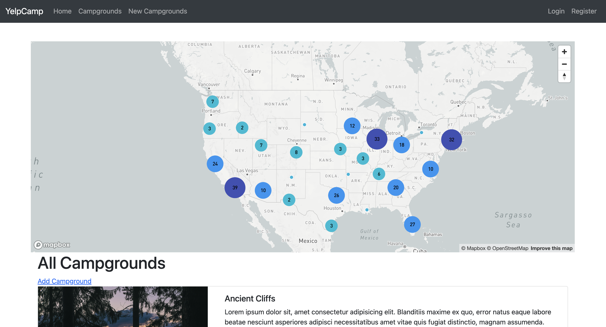
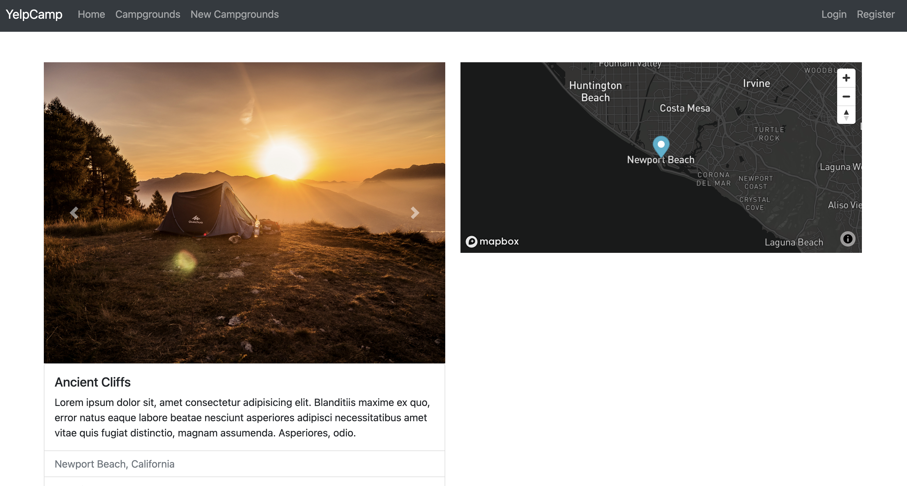
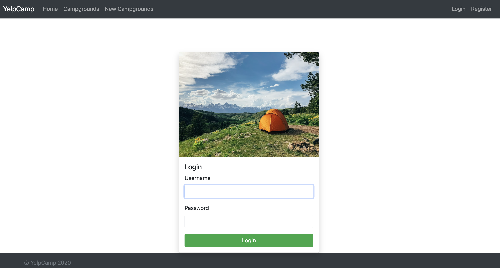

# YelpCamp
YelpCamp is a full-stack web application where users can create and review campgrounds. In order to review or create a campground, you must have an account. This project is a part of Colt Steele's web development bootcamp course on Udemy.

This project has been created using Node.js, Express, MongoDB, and Bootstrap. Passport.js is used to handle authentication.

## Functionalities
* Users can view the campgrounds submitted by other people and reviews without signing up or logging in.

* Users will have to login or sign up to create their own campground or leave a review on others

* Users can only edit/delete the campgrounds and comments that they have added.

## Technologies Used:
* HTML5 - A markup language used to structure and display content on the web.

* CSS3 - A stylesheet language used to describe the presentation of a document written in HTML or XML.

* Bootstrap - A free and open-source front-end framework for quickly designing responsive, mobile-first websites and web applications.

* jQuery - A lightweight, cross-platform JavaScript library designed to simplify HTML client-side scripting.

* DOM Manipulation - Involves using the Document Object Model (DOM) to dynamically access and update the content, structure, and styles of a web document.

* Node.js - An open-source, cross-platform JavaScript runtime that executes code server-side, enabling scalable network applications.

* Express.js - A minimal and flexible Node.js web framework used for building APIs and web applications through middleware and routing.

* REST - An architectural style (Representational State Transfer) for designing scalable web services that use standard HTTP methods to manage data.

* MongoDB - An open-source, document-oriented NoSQL database for storing data as JSON-like documents, ideal for managing user details, campground information, and comments.

* PassportJS - Authentication middleware for Node.js, offering a modular approach to integrating various authentication strategies into Express-based web applications.

* Heroku - A cloud Platform as a Service (PaaS) that simplifies the deployment, management, and scaling of web applications.

## Images

### The Home Page

### Main campgrounds Page

### Single Campground Page

### Login Page
